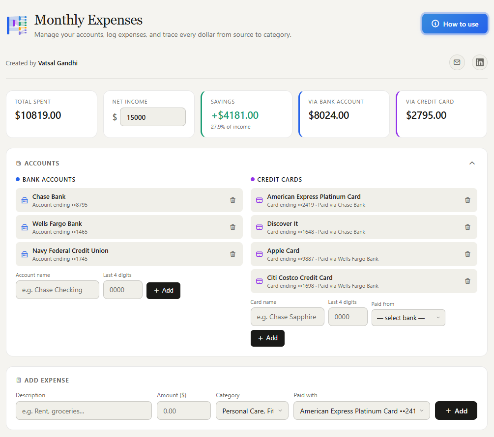
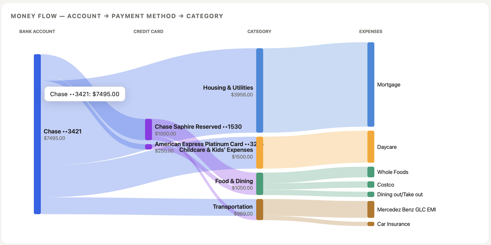
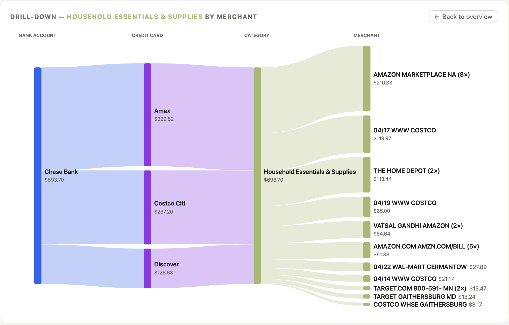
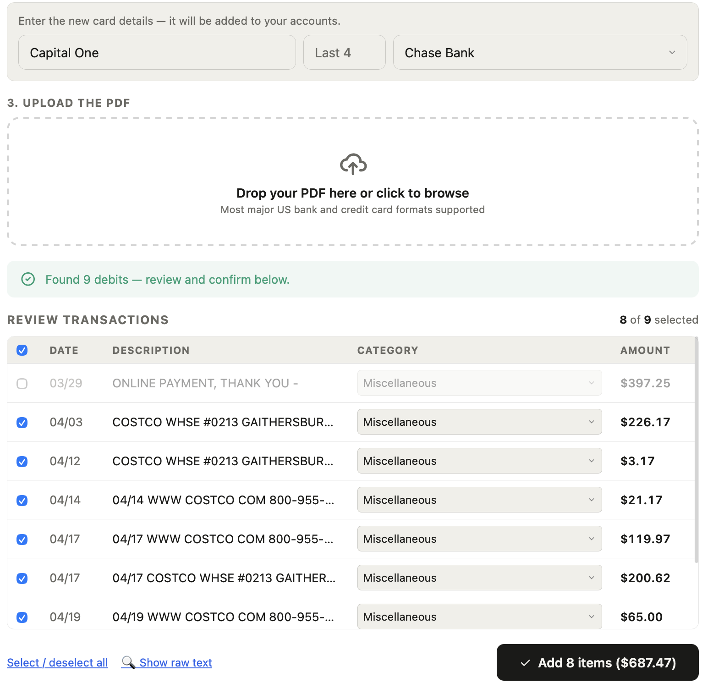

# 💸 Personal Expense Tracker

### ✨ Track your money. See where it flows. Save where it matters. ✨

A clean, interactive monthly expense tracker that runs entirely in your browser.
**No signup. No backend. No data leaving your machine.** Just one HTML file. 🪄

---

[](https://vatsalgandhi93.github.io/Expense-Tracker)
[](LICENSE.md)
[](#%EF%B8%8F-tech-stack)
[](#-privacy-first)

---



---

## 🌟 Why This Exists

Most budgeting apps either want access to your bank account, charge a monthly fee, or bury the one thing you actually want to see — **where is my money going?** 🤔

So instead of looking for the right app, I built my own. ⚡

- 📂 One HTML file
- 🔒 100% browser-based
- 💯 Free forever
- 🎯 Visual-first design

---

## ✨ Features

### 💳 Money Management
- 🏦 Multiple bank accounts
- 💳 Multiple credit cards (linked to their funding bank)
- 🎯 10 spending categories
- 💰 Net income & savings tracking
- 🚨 Overspending alerts (savings card turns red)

### 📄 Statement Import
- 📤 Upload PDF statements (drag-and-drop or click)
- 🤖 Auto-categorisation with 100+ merchant keywords
- 🏦 Credit card OR bank account flows
- ✅ Smart credit/debit detection for bank statements
- 👀 Full review table before importing
- ➕ Add new accounts inline during import

### 📊 Live Visualisations
- 🍩 Donut chart — category breakdown
- 📊 Bar chart — sorted by spend
- 🌊 Sankey diagram — visual money flow
- 🔍 **NEW: Click-to-drill** into any category
- 🏷️ Smart merchant grouping (e.g. "Starbucks 3×")

### 🎨 Polish
- 🌓 Dark mode (follows system preference)
- 📱 Fully responsive on mobile, tablet, and desktop
- 📥 Export as PDF with one click
- 📖 Built-in tutorial accessible anytime

---

## 🎯 Spending Categories

| Color | Category |
| :---: | :--- |
| 🔵 | Housing & Utilities |
| 🫒 | Household Essentials & Supplies |
| 🟢 | Food & Dining |
| 🟤 | Transportation |
| 🟠 | Childcare & Kids' Expenses |
| 🌸 | Lifestyle Spending |
| 🔴 | Healthcare & Insurance |
| 🟣 | Travel & Entertainment |
| 💚 | Savings & Investments |
| ⚪ | Miscellaneous |

---

## 🌊 The Star of the Show — Sankey Diagram

```
🏦 Bank Account  ──►  💳 Credit Card  ──►  📦 Category
```

Every ribbon represents money flowing between stages. **The wider the ribbon, the more money moved that way.**

### 🔍 Now With Drill-Down!

Click any category node and watch the diagram expand into a per-merchant breakdown:

```
🏦 Bank  ──►  💳 Card  ──►  🍔 Food & Dining  ──►  ☕ Starbucks (3×)
                                              ──►  🥗 Sweetgreen (2×)
                                              ──►  🍕 Domino's
```

Smart merchant grouping means five Starbucks visits become one tidy node. 💡 No more cluttered diagrams.

---

## 🚀 Getting Started

### ⚡ Option 1 — Just Open the Demo
👉 **[Click here to use the live app](https://vatsalgandhi93.github.io/Expense-Tracker)**

Nothing to install. Works on any modern browser.

### 💻 Option 2 — Run It Locally

```bash
# 📥 Clone the repo
git clone https://github.com/vatsalgandhi93/Expense-Tracker.git

# 🚀 Open in your browser
open index.html
```

No build step. No `npm install`. No config. Just open and go. ✨

---

## 🗂️ How to Use

| Step | What to do |
| :---: | :--- |
| 1️⃣ | **Add a bank account** in the Accounts panel (name + last 4 digits) |
| 2️⃣ | **Add credit cards** *(optional)* — pick which bank pays them off |
| 3️⃣ | **Log expenses** manually OR import a PDF statement |
| 4️⃣ | **Set your net income** to see live savings calculations |
| 5️⃣ | **Click categories in the Sankey** to drill into merchants 🔍 |
| 6️⃣ | **Save as PDF** anytime for a clean monthly snapshot |

---

## 🛠️ Tech Stack

| Layer | Technology |
| :---: | :--- |
| 🏗️ Structure | HTML5 |
| 🎨 Styling | CSS3 with custom properties, dark mode, print styles |
| ⚡ Logic | Vanilla JavaScript (ES6+) — no frameworks |
| 📊 Charts | [Chart.js 4.4](https://www.chartjs.org/) |
| 🌊 Sankey | Custom renderer on [D3.js 7](https://d3js.org/) |
| 📄 PDF parsing | [PDF.js 3.11](https://mozilla.github.io/pdf.js/) |
| ✨ Icons | [Tabler Icons](https://tabler-icons.io/) |

> 💪 **No frameworks. No bundler. No dependencies to install.** Everything loads from CDN at runtime.

---

## 🔒 Privacy First

This app runs **100% in your browser**:

- 💯 No backend
- 🚫 No database
- 🚫 No cookies
- 🚫 No tracking
- 📤 Nothing uploaded — ever

When you upload a PDF statement, [PDF.js](https://mozilla.github.io/pdf.js/) parses it **locally in your browser** — the file never touches a server. Your financial data disappears the moment you close the tab.

---

## 📁 Project Structure

```
Expense-Tracker/
├── 📄 index.html      ◀── The entire app (self-contained)
├── 📘 README.md       ◀── You are here
└── 📜 LICENSE.md      ◀── Usage terms
```

---

## 📸 Screenshots

| 🎯 Dashboard Overview | 🌊 Sankey Flow Diagram |
| :---: | :---: |
|  |  |
| **🔍 Sankey Drill-Down** | **📤 Statement Import** |
|  |  |

---

## 🆕 What's New in the Latest Version

### 🎉 Major Updates

- 🔍 **Interactive Sankey drill-down** — click categories to expand into merchants
- 📤 **PDF Statement Import** — credit card AND bank account flows
- 🤖 **Smart auto-categorisation** with 100+ merchant keywords
- 🆕 **New category:** Household Essentials & Supplies
- ✏️ **Renamed:** "Personal Care, Fitness & Discretionary" → **Lifestyle Spending**
- 📥 **Save as PDF** for monthly archives
- 📖 **In-app guide** accessible from the header anytime

---

## 💬 Feedback & Connect

Got a suggestion? Found a bug? Want to chat about the project? **I'd love to hear from you!**

- 📧 **Email:** [vatsalgandhi93@gmail.com](mailto:vatsalgandhi93@gmail.com)
- 💼 **LinkedIn:** [linkedin.com/in/vatsalgandhi93](https://www.linkedin.com/in/vatsalgandhi93)

---

## 📄 License

This project is licensed under a **custom proprietary license**. See [LICENSE.md](LICENSE.md) for full terms.

> 🎁 **TL;DR** — Free for personal, non-commercial use. Redistribution, modification, and commercial use are prohibited.

**© 2026 Vatsal Gandhi.** All rights reserved.

---

### 🤖 Built with [Claude](https://claude.ai) as a thinking partner. ⚡

**If this project helped you, give it a ⭐ on GitHub!**
