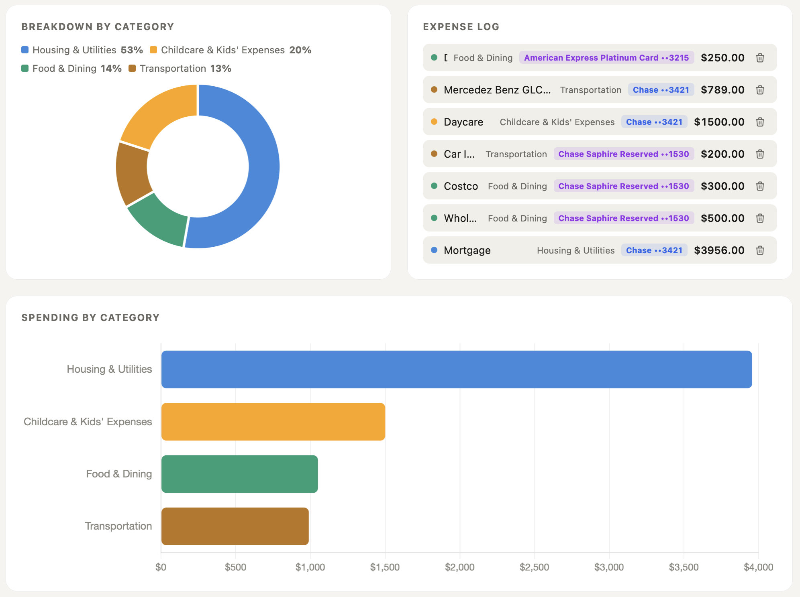

# 💸 Personal Expense Tracker

A clean, interactive monthly expense tracker that runs entirely in your browser — no signup, no backend, no data leaving your machine. One HTML file. Open it and go.

> 🔗 **[Live Demo →](https://vatsalgandhi93.github.io/Expense-Tracker/)**

---


<!-- Replace screenshot.png with your actual screenshot filename -->

---

## ✨ Features

- **Account management** — add multiple bank accounts and credit cards, with each credit card linked to the bank account that pays it off
- **Expense logging** — log expenses by description, amount, category, and payment method
- **Net income & savings** — enter your monthly take-home pay and see your savings (or deficit) update in real time
- **10 spending categories** — Housing & Utilities, Food & Dining, Transportation, Childcare & Kids' Expenses, Personal Care Fitness & Discretionary, Healthcare & Insurance, Travel & Entertainment, Savings & Investments, Miscellaneous
- **Donut chart** — live category breakdown with percentage splits
- **Bar chart** — spending by category ranked largest to smallest
- **Sankey flow diagram** — traces every dollar across 4 stages:
  ```
  Bank Account → Credit Card → Category → Individual Expense
  ```
- **How to use guide** — built-in info modal for first-time users
- **Dark mode** — automatically follows your system preference
- **Fully offline** — no server, no API calls, no tracking

---

## 🚀 Getting Started

### Option 1 — Use the live demo
Click the **[Live Demo](https://yourusername.github.io/expense-tracker)** link above. Nothing to install.

### Option 2 — Run locally
```bash
# Clone the repo
git clone https://github.com/yourusername/expense-tracker.git

# Open in your browser — that's it
open index.html
```

No build step. No `npm install`. No config. Just open the file.

---

## 🗂️ How to Use

1. **Add a bank account** — open the Accounts panel, enter a name and optionally your last 4 digits
2. **Add a credit card** *(optional)* — enter the card name and select which bank account pays it off
3. **Log an expense** — fill in description, amount, category, and which account you paid with
4. **Set your net income** — type your monthly take-home in the income field to see your savings calculated automatically
5. **Delete any entry** — click the trash icon in the expense log; all charts update instantly

---

## 🛠️ Tech Stack

| Layer | Technology |
|---|---|
| Structure | HTML5 |
| Styling | CSS3 (custom properties, dark mode) |
| Logic | Vanilla JavaScript (ES6+) |
| Charts | [Chart.js 4.4](https://www.chartjs.org/) |
| Sankey diagram | Custom renderer built on [D3.js 7](https://d3js.org/) |
| Icons | [Tabler Icons](https://tabler-icons.io/) |

No frameworks. No bundler. No dependencies to install.

---

## 📁 Project Structure

```
expense-tracker/
│
├── index.html        # The entire application — self-contained
└── README.md         # This file
```

---

## 📸 Screenshots

| Dashboard | Charts | Sankey Diagram |
|---|---|---|
|  |  | |

<!-- Add your own screenshots to the repo and update filenames above -->

---

## 🤝 Feedback

Have a suggestion or found a bug? I'd love to hear from you.

- 📧 [vatsalgandhi93@gmail.com](mailto:vatsalgandhi93@gmail.com)
- 💼 [linkedin.com/in/vatsalgandhi93](https://www.linkedin.com/in/vatsalgandhi93)

---

## 📄 License

MIT — free to use, modify, and share.

---

*Built with [Claude](https://claude.ai) as a thinking partner.*
